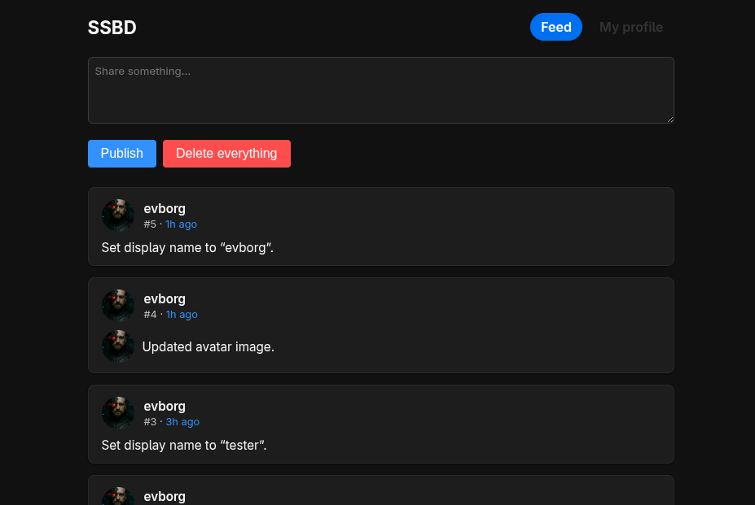

# SSBD (secure-scuttlebot-deno) ⚓️

SSBD is a lightweight Secure Scuttlebutt peer/server written in Deno that serves your log over HTTP + WebSocket, provides a modern in-browser client, and wraps the REST bridge helpers needed to follow remote peers. It handles Ed25519 key generation, publishing posts, following/unfollowing contacts, updating profile names/avatars (with local blob storage), and rendering richer message types like `about`, `contact`, and git-ssb updates—all with offline caching and live updates in the browser.



## 🚀 Getting started

1. **Install Deno** (v1.40+): follow [deno.land/manual/getting_started](https://deno.land/manual/getting_started/installation).
2. **Clone this repo**: `git clone https://example.com/ssbd && cd ssbd`.
3. **Run the server**:
   ```bash
   deno run --allow-all serve.ts
   ```
   (Use `ssbd.ts` for the minimal API-only server.)
4. **Open the browser UI** at `http://127.0.0.1:8790/`. The client generates keys if needed and starts syncing.

## ✨ Features

- 📡 Real-time feed sync over WebSocket plus REST endpoints (`/feed`, `/publish`, `/feeds/:id`, etc.).
- 🧑‍🚀 Browser client with offline cache, post composer, profile editor (name + avatar upload), follow/unfollow controls, and rich renders for git/contact/about messages.
- 🗂️ Integrated blob storage (`/blobs/add`, `/blobs/:hash`) that hashes uploads and serves them back with metadata.
- 🔁 Optional REST bridge integration to automatically follow upstream peers.

## 🧰 Useful commands

- `deno run --allow-all serve.ts` — full server with UI + bridge helpers.
- `deno run --allow-all ssbd.ts` — minimal API server for scripting/tests.
- `deno test` — run unit tests (when added).

Happy Scuttling! ⛵️

---
MIT
